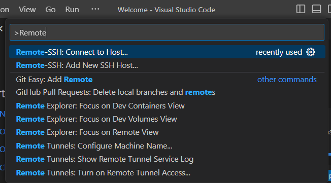
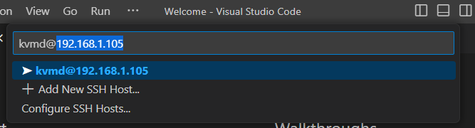
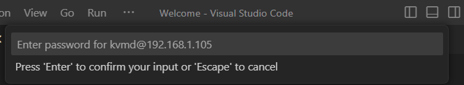
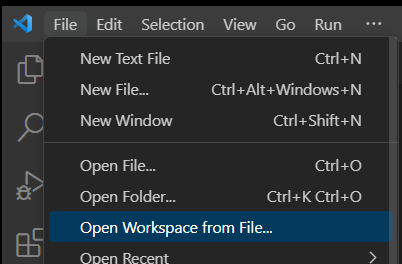
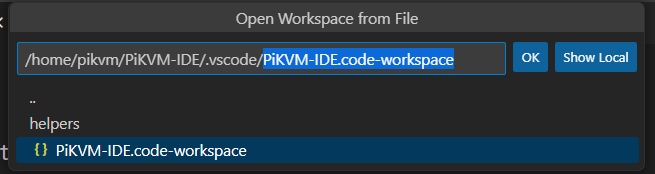
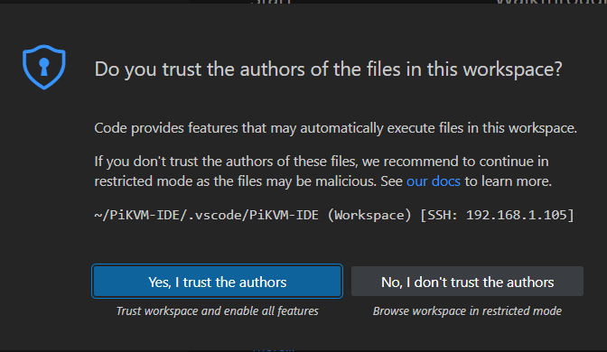

# PiKVM Development Environment
Making it easy to work on PiKVM by bringing heavy-weight tools into the lightweight PiKVM embedded environment.


## Use Cases:
1. You want to debug KVMD by clicking a line and pressing F5 to start.
2. You want to benefit from GUI-based tools.
3. You don't have Arch installed on a computer.
4. You want to work from your desktop and install minimum items on your PiKVM.
5. You'd prefer to press F1 or F5 to run tasks rather than copy-paste from notepad.
6. You want your settings, source, and preferences all organized neatly.
7. You want to know exactly what's contained within a variable at runtime by hovering.
8. You want to use one of the 30,000 VSCode Exensions
9. You don't mind VSCode because, even though it's from Microsoft, it's open source.
10. You still haven't figured out how to exit VIM (it's [esc]q[enter]). 

## Getting started

Getting started is pretty simple.  Run a script, and then connect to the PiKVM. If you don't have it already, download and install [VSCode from the Download Page](https://code.visualstudio.com/download)

Setup consists of 2-steps:
1. Setup `kvmd` user
2. Open the environment with VSCode

### Set kvmd user
The objective of the following is to get the system prepared for the `kvmd` user to log in and perform debugging operations on the system.  


To start in the PiKVM Webterm, first execute `su` and enter your root password (default: `root`). 
You can copy the entire block below and execute within the PiKVM WebTerminal as root.
``` bash
rw

#Grant kvmd user login, and sudo access without password
sed -i /etc/passwd -e 's|main daemon:/:/usr/bin/nologin|main daemon:/home/pikvm:/bin/bash|g'
{ for i in 1 2; do sleep .2; echo kvmd ; done; }|passwd kvmd
echo 'kvmd ALL=(ALL:ALL) NOPASSWD: ALL' > /etc/sudoers.d/99_kvmd-all

#Configure ssh server
echo "PasswordAuthentication yes">>/etc/ssh/sshd_config
systemctl restart sshd.service

# Set up kvmd development environment
mkdir -m 00777 -p /home/pikvm
install -C -m 775 -o kvmd -g kvmd /root/.bash_profile /home/pikvm/
su - kvmd -c 'mkdir -p ~/PiKVM-IDE; git clone https://github.com/pikvm/kvmd.git; git clone https://github.com/adamoutler/PiKVM-IDE.git'

#Display IP addresses for user
echo "Interfaces & IPs for PiKVM:";ip -o address|grep inet\ |sed 's|/.*||'
reboot
```
> 💡 Make note of the IP address, it  be used in step 3 of the the following section.

### Open the environment with VSCode

1. Open VSCode.
2. Press the `F1` key, then type "Remote-SSH: Connect to Host..." and press enter to select.



3. Type kvmd@[PiKVM Ip Address] and press enter to select.
> 💡 If you "Could not establish connection", try `ssh kvmd@[ip.add.re.ss]` from your command line to fix connection issues.



4. Use the password `kvmd`. 
> 💡 Change your password with the `usermod --password "my password" kvmd` command from PiKVM Webterm!



VSCode will download required resources and prepare your environment.  
> ❔ If VSCode fails to login, try running `rw` in webterm or check your internet connection.

> ❓ Still doesn't work? try running `rm -rf /home/pikvm/.vscode-server`

5. Press File>Open Workspace from File..



6. Select `/home/pikvm/PiKVM-IDE/.vscode/PiKVM-IDE.code-workspace` and press enter



7. Select "Yes, I trust the authors". 


8. If presented the option in the lower right corner, install the recommended extensions.


### Reconnecting
If you have rebooted the PiKVM, you will need to run `rw` as root. You can do this from WebTerm.

To open the Development Environment, click File>Open Recent>PiKVM-IDE.  Otherwise see the section: Open the environment with VSCode.


### After Reboot
After a reboot, VSCode will not login until you execute `rw` as root.  You can open the WebTerm and type `rw`, then simply open VSCode and it will reconnect.


## Debugging
To being debugging KVMD perform the following

1. Press F1->Tasks->Link KVMD Source into System
2. Press F1->Tasks->Stop KVMD System Service
3. Press F5 to begin debugging

> ❗ To reset your system, Just use F1->Tasks->Unlink Source from System, F1->Tasks->Restart KVMD!

